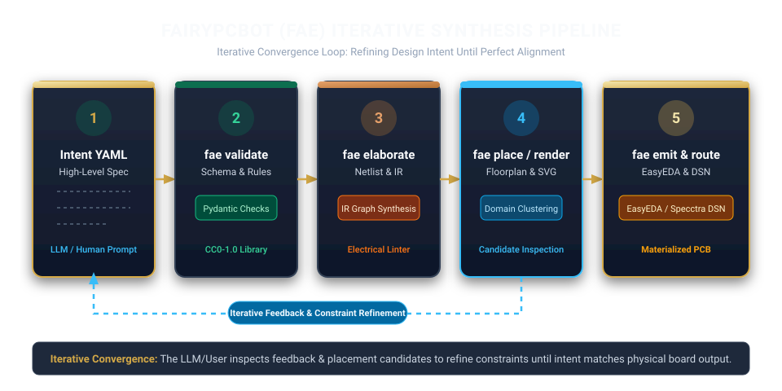
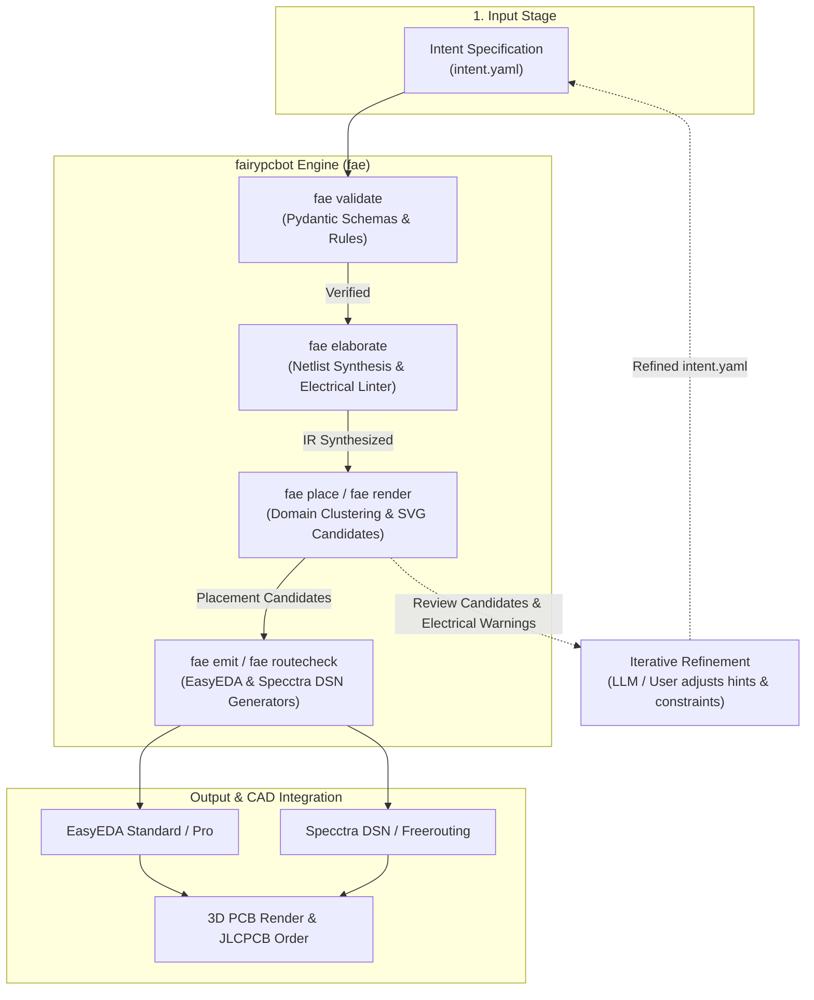
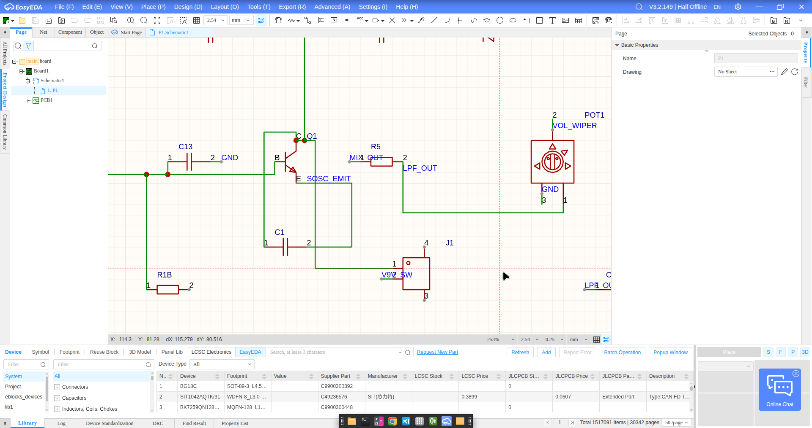
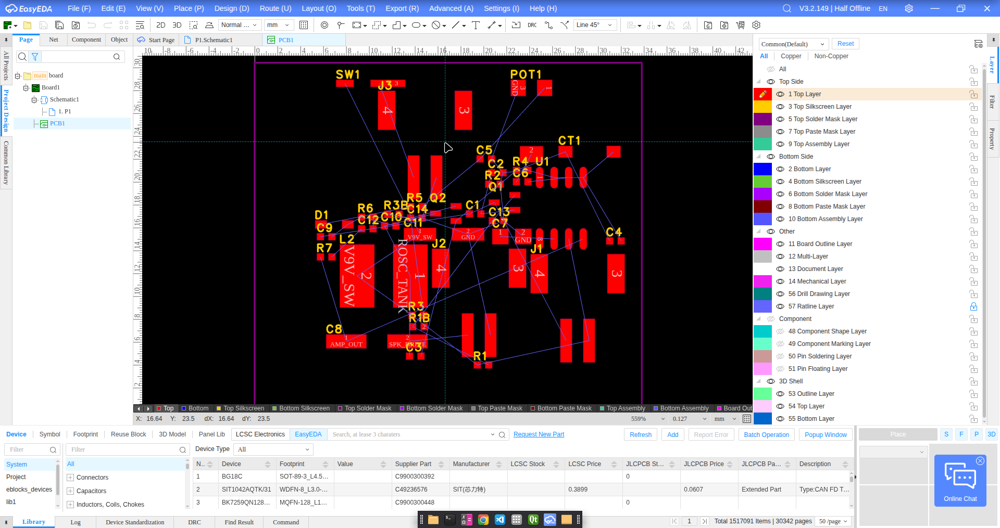
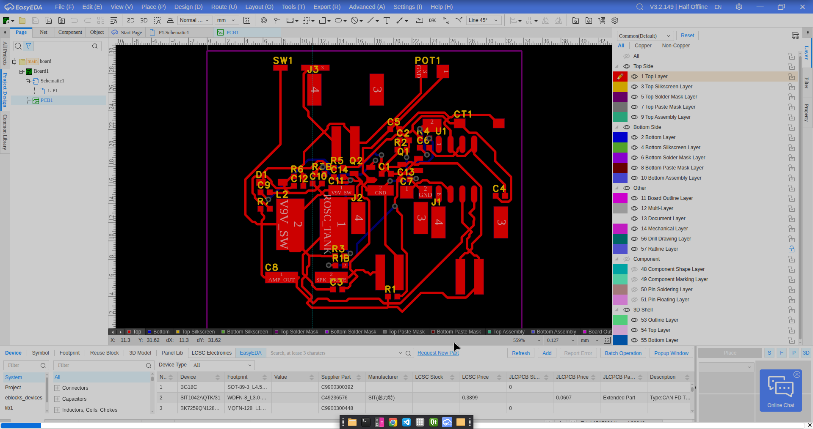
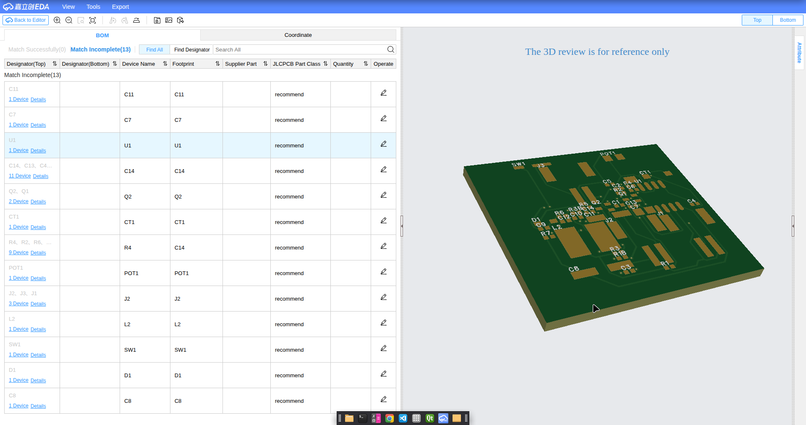

# fairypcbot 🧚

Intent-driven PCB design framework — describe what your board must do, let automation handle
the rest.


> **Experimental project.** The outputs of this tool have not been independently validated for
> fabrication. Do not rely on them for safety-critical applications or any use case that requires
> guarantees of correctness, quality, or performance.

> The LLM is the author of constraints in YAML. The framework validates and materializes them
> into geometry. The user has the final say.

Mascot: **Fae the fairy engineer** — voice of the audit reports and the CLI.  
Main command: `fairypcbot`, short alias: **`fae`**.

---

## 🌟 What fairypcbot Does

`fairypcbot` bridges the gap between AI LLM agents and electronic design automation (EDA). Instead of asking LLMs to generate complex CAD coordinates or proprietary format syntaxes, you (or an AI agent) describe higher-level **intents** in structured YAML.

- 🎯 **Intent-Driven Synthesis**: Declare functional goals (`decouples`, `power_rail`, `differential_pair`, `crystal_oscillator`) rather than placing every wire manually.
- ⚡ **Electrical Linter & Formal Validation**: Instant validation via Pydantic schemas checking for floating input pins, ungrounded power rails, designator conflicts, and circular imports.
- 🗺️ **Domain-Based Floorplanning**: Physics-informed placement heuristics automatically cluster decoupling capacitors near IC power pins and keep high-frequency feedback loops compact.
- 🖨️ **Multi-CAD Emission**: Materialize valid layouts into native EasyEDA (Standard & Pro) files or Specctra DSN format for automated routing via Freerouting.
- 🛡️ **Clean Data Provenance**: 100% authorial CC0-1.0 founding library. Vendor data is fetched on-demand directly to the user's local cache (`~/.cache/fairypcbot/`), keeping the codebase 100% free of third-party licensing encumbrances.

---

## 🚀 Simplicity Meets Power

### How Simple It Is

`fairypcbot` supports two complementary workflows depending on whether you prefer AI automation or direct CLI control:

#### 🤖 1. Fully Autonomous / LLM-Guided Workflow (Primary & Most Common)

This is the primary way to use `fairypcbot`. You don't need to write YAML files or memorize CLI commands — simply prompt any LLM agent (via VSCode, Claude Desktop, Antigravity, or terminal) to design a board:

> *"Create a PCB project in EasyEDA implementing a simple, analog metal detector."*

1. **Autonomous Execution**: The LLM agent queries `fairypcbot` (`fae llm`), asks you **only strictly essential questions** (e.g. target board dimensions, power connector preference), and autonomously assumes typical engineering best practices for everything else (decoupling capacitance, ground planes, feedback loops).
2. **Automated Synthesis**: The LLM writes `intent.yaml`, runs `fae validate`, `fae elaborate`, and `fae place`, inspecting layout candidates automatically.
3. **Ready-to-Route CAD Output**: The LLM outputs a complete CAD project (e.g. EasyEDA Standard/Pro) with **all components already physically placed in valid floorplans**.

All components arrive pre-placed with optimal decoupling and signal proximity. All that remains is for you to route the board (manually or via your preferred autorouter), verify the schematic/PCB, and send it straight to fabrication!

---

#### 🛠️ 2. Manual CLI Workflow (Direct Control)

If you prefer direct hands-on control, going from an explicit `intent.yaml` to a placed CAD project takes 5 straightforward CLI commands:

```bash
fae init my_project
cd my_project
# Edit intent.yaml manually
fae validate
fae elaborate
fae place
fae emit --target easyeda_std
```

---

### How Powerful It Gets

Under the hood, `fairypcbot` performs multi-layer synthesis:
- **Graph-Based Netlist Synthesis**: Converts abstract intents into an Intermediate Representation (IR) containing netlists, electrical rules, and domain groupings.
- **Physics-Informed Heuristics**: Evaluates `compact`, `spread`, and `balanced` floorplans, computing routability estimates, cell clamps, and thermal clearance guards.
- **Ratsnest SVG Rendering**: Generates instant high-resolution SVG visual candidates in `build/` so engineers and LLMs can inspect floorplans before committing to CAD tools.

---

## 📐 Architecture & Pipeline





### Iterative Convergence Loop

`fairypcbot` is designed as an **iterative synthesis pipeline**, not a one-shot black box:

1. **Specify Intent:** You or an LLM write a high-level `intent.yaml`.
2. **Validate & Elaborate:** `fae validate` and `fae elaborate` check pin roles, designators, and electrical rules (warning on floating inputs or ungrounded power pins).
3. **Inspect Candidates:** `fae place` generates candidate floorplans and renders ratsnest SVGs in `build/`.
4. **Refine Iteratively:** The LLM or engineer inspects placement SVGs and linter warnings, then adjusts placement hints, domain groupings, or board dimensions in `intent.yaml`.
5. **Converge & Emit:** Once candidate layouts converge to your design intent, `fae emit` materializes the board into EasyEDA or Specctra DSN formats.

---

## 🛠️ Status & Implementation

Milestones M1–M5 of the roadmap are implemented:

| Stage | Command | What it does |
|---|---|---|
| 1. Intent | — | You (or the LLM) write `intent.yaml` |
| 2. Validation | `fae validate` | Checks references, pins, import cycles, intent types |
| 3. Elaboration | `fae elaborate` | Generates `netlist.json` + `rules.json` and runs the electrical linter |
| 4. Placement | `fae place` / `fae render` | Derives domains, generates 1–3 layout candidates + SVG |
| 5. Emission | `fae emit` / `fae routecheck` | Materializes into EasyEDA Std/Pro or Specctra DSN |
| — | `fae catalog fetch` | Resolves a component via the public EasyEDA API (LCSC) |
| — | `fae audit show/trace/note` | Queries the audit trail from intent to decision to artifact |

**Before trusting the output for fabrication**, read
[`docs/limitations.md`](docs/limitations.md): without real pad geometry (obtained via
`catalog fetch`), the output is a *placement preview*, not a routable board. This is reported
explicitly on every `emit` run as a per-part degradation.

---

## 📸 Examples & Showcase

### `led_blinker_555` — offline "hello world"

[`examples/led_blinker_555/`](examples/led_blinker_555/) is a classic 555 timer LED blinker.
It uses only `class:` references from the founding library — no network access or vendor data
required. Serves as the CI smoke test.

```bash
fae validate  -p examples/led_blinker_555
fae elaborate -p examples/led_blinker_555
fae place     -p examples/led_blinker_555
```

### `metal_detector_bfo` — analog showcase

[`examples/metal_detector_bfo/`](examples/metal_detector_bfo/) is a fully analog BFO metal
detector (two Colpitts oscillators + diode mixer + LM386 audio amp). It requires vendor data
obtained via `catalog fetch`:

```bash
cd examples/metal_detector_bfo
fae catalog fetch lcsc:C22438596   # LM386M-1
# ... see examples/metal_detector_bfo/README.md for the full list
fae validate && fae elaborate && fae place && fae emit --target easyeda_std
```

#### BFO Metal Detector Gallery

| Schematic Synthesis | Unrouted Ratsnest Floorplan |
|---|---|
|  |  |

| Interactive Routing Process in Progress | 3D Board Render |
|---|---|
|  |  |

> *Note: The image above demonstrates the interactive copper routing process in progress within EasyEDA after importing fairypcbot's placement floorplan and netlist.*

---

## 🔮 Future Roadmap

We are actively expanding `fairypcbot`. Future developments include:

- 🍞 **Breadboard & Rapid Prototyping Emitters**: Emitters specifically designed to assist hands-on prototyping on breadboards, stripboards/perfboards, and point-to-point wiring before manufacturing PCBs. Potential effective formats under evaluation:
  - 🎨 **Interactive Breadboard Assembly Diagrams (Fritzing / DIYLC style)**: Visual step-by-step wiring diagrams mapping component legs to breadboard hole coordinates (e.g. `U1 Pin 1 -> Row 12, Col a-e`).
  - 📋 **Human-Readable Wiring & Pinout Tables**: Terminal & Markdown tables listing point-to-point jumper connections (e.g. `Wire #4 (Red): From U1.VCC -> Breadboard +5V Rail`).
  - 🖨️ **Printable Perfboard / Stripboard Templates (1:1 SVG)**: Printable overlays showing stripboard track cuts, jumper bridges, and DIP socket placements.
- 🔌 **Additional EDA Emitters**: Support for KiCad 8+ (`.kicad_pcb` / `.kicad_sch`), Altium Designer, and LibrePCB formats.
- 🔄 **Project Importer & Reverse-Engineering**: Import existing KiCad, Eagle, or EasyEDA projects into fairypcbot `intent.yaml` structures.
- 📦 **Community Open-Source Library Ecosystem**: Dedicated community repository for verified CC0 component classes, datasheets, and IPC-7351 footprints completely free of vendor licensing encumbrances.
- 🤖 **Native MCP Server Plugin**: Model Context Protocol (MCP) tool server for seamless integration with VSCode, Claude Desktop, and AI coding agents.

---

## ⚠️ Open Challenges & Known Issues (Help Needed!)

We welcome community contributions! Key areas currently seeking improvements include:

- 📐 **Schematic Visual Layout Optimization**: Improving automatic symbol placement and wire routing in emitted EasyEDA Pro/Std schematics to minimize visual crossing of net labels.
- 🔀 **Bidirectional PCB & Schematic Coherence**: Ensuring strict 1:1 cross-probing and synchronized back-annotation when layout edits are performed in external CAD tools.
- 🧊 **Automatic 3D Model Association**: Automating STEP 3D model linking for generic authorial component classes without requiring explicit vendor catalog fetches.

---

## 💻 Installation & Quick Start

```bash
python3 -m venv .venv
source .venv/bin/activate
pip install -e ".[dev]"
```

Run test suite offline:
```bash
pytest -m "not network"                              # test suite (offline)
ruff check src tests                                 # lint
mypy src/fairypcbot/schemas src/fairypcbot/registry  # strict type check
```

---

## 📜 Data, Licensing & Provenance

- **Code**: [Apache-2.0](LICENSE).
- **`library/`**: [CC0-1.0](library/LICENSE). Contains only authorial descriptors (component classes and generic packages) — no vendor data.
- **No vendor data is redistributed.** `fae catalog fetch` and `fae datasheet ingest` download third-party data **directly to the user's machine** (cached in `~/.cache/fairypcbot/`, outside the repository). That data remains subject to the terms of its source (EasyEDA/LCSC, manufacturers). **Verifying and complying with those terms is the user's responsibility**.

---

## 📖 Technical Documentation

- [`docs/llm/`](docs/llm/) — LLM integration contract (`fae llm` prints the index)
- [`docs/ir.md`](docs/ir.md) — format of `netlist.json`, `rules.json`, `placement.json`
- [`docs/easyeda_format.md`](docs/easyeda_format.md) — subset of EasyEDA format covered
- [`docs/limitations.md`](docs/limitations.md) — known limitations by area
- [`docs/library_repo.md`](docs/library_repo.md) — library repository structure

See [`CONTRIBUTING.md`](CONTRIBUTING.md) for contribution guidelines.

*— Built by Fabrício Ribeiro Toloczko & Fae the Fairy Engineer.*
